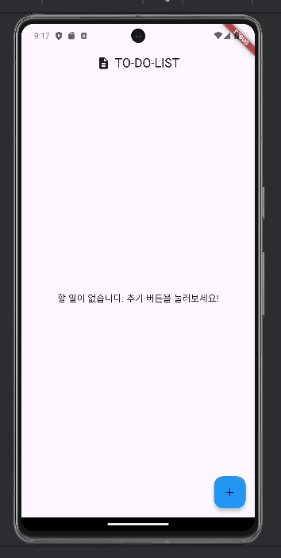
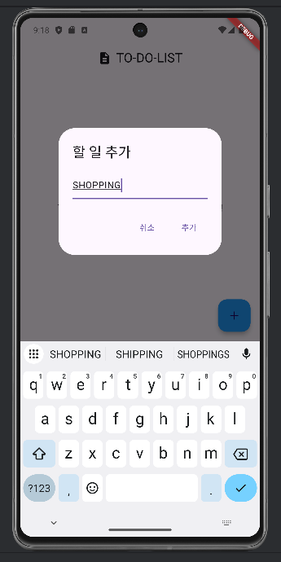
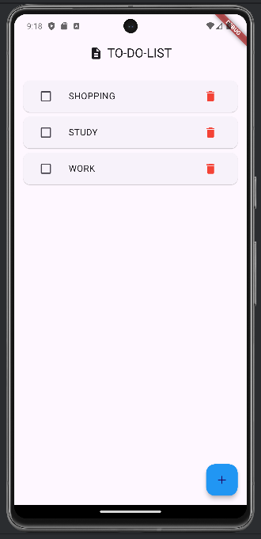

# 프로젝트 이름 : Flutter TO-DO-APP

> TO DO LIST 를 작성, 체크, 삭제할 수 있는 간단한 앱

## 🖼️ Screenshots

### Screenshot 1

### Screenshot 2

### Screenshot 3

## 🌟 Features
- TO-DO-LIST 작성
- TO-DO-LIST 삭제
- TO-DO-LIST 체크

## 🧩 Widgets Overview

### 1. **Scaffold**
- **역할**: Flutter 앱의 기본 레이아웃을 구성하는 컨테이너. 화면의 상단, 본문, 하단 버튼 등을 정의하는 역할을 합니다.
- **속성**:
  - `appBar`: 화면 상단에 `AppBar` 위젯을 추가.
  - `body`: 화면의 주 콘텐츠를 구성하는 `Padding` 위젯으로 설정.
  - `floatingActionButton`: 화면 하단 오른쪽에 `FloatingActionButton` 추가.

---

### 2. **AppBar**
- **역할**: 화면 상단에 제목과 아이콘을 표시하는 영역을 제공합니다.
- **속성**:
  - `title`: 중앙에 표시되는 `Row` 위젯.
  - `centerTitle`: `true`로 설정해 제목을 중앙 정렬.

---

### 3. **Row**
- **역할**: 자식 위젯들을 수평으로 나란히 배치합니다.
- **속성**:
  - `mainAxisAlignment`: `MainAxisAlignment.center`로 설정해 자식 위젯을 수평 중앙 정렬.
  - `children`: `Icon`과 `Text`로 구성된 리스트.

---

### 4. **Padding**
- **역할**: 위젯 주위에 여백을 추가해 레이아웃을 구성합니다.
- **속성**:
  - `padding`: `EdgeInsets.all(16.0)`으로 설정해 화면의 모든 면에 16px의 여백 추가.
  - `child`: `Column` 위젯.

---

### 5. **Column**
- **역할**: 자식 위젯들을 수직으로 나란히 배치합니다.
- **속성**:
  - `crossAxisAlignment`: `CrossAxisAlignment.center`로 설정해 자식 위젯을 수평 중앙 정렬.
  - `mainAxisAlignment`: `MainAxisAlignment.center`로 설정해 자식 위젯을 수직 중앙 정렬.
  - `children`: 할 일이 없는 경우와 있는 경우를 조건부로 렌더링.

---

### 6. **Expanded**
- **역할**: 부모 위젯의 남은 공간을 차지하도록 자식 위젯을 확장합니다.
- **속성**:
  - `child`: `Center` 또는 `ListView.builder`.

---

### 7. **Center**
- **역할**: 자식 위젯을 부모 위젯의 중앙에 배치합니다.
- **속성**:
  - `child`: `Text`.

---

### 8. **Text**
- **역할**: 화면에 문자열 데이터를 표시합니다.
- **속성**:
  - `data`: 텍스트 내용 ('할 일이 없습니다. 추가 버튼을 눌러보세요!' 등).
  - `style`: `TextStyle`로 텍스트 스타일 정의.
    - `fontSize`: 텍스트 크기 지정 (예: 16).

---

### 9. **ListView.builder**
- **역할**: 동적으로 생성된 목록을 렌더링합니다.
- **속성**:
  - `itemCount`: 리스트 항목의 개수 지정 (`_toDoList.length`).
  - `itemBuilder`: 리스트의 각 항목을 빌드하는 콜백 함수.

---

### 10. **Card**
- **역할**: 깔끔한 카드 형태로 각 항목을 표시합니다.
- **속성**:
  - `margin`: `EdgeInsets.symmetric(vertical: 4)`로 상하 여백 추가.
  - `child`: `ListTile`.

---

### 11. **ListTile**
- **역할**: 각 목록 항목의 구조를 구성합니다. (왼쪽 아이콘, 제목, 오른쪽 아이콘 등)
- **속성**:
  - `leading`: 리스트 항목 왼쪽에 표시되는 `Checkbox`.
  - `title`: 할 일의 텍스트를 표시하는 `Text`.
  - `trailing`: 리스트 항목 오른쪽에 표시되는 `IconButton`.

---

### 12. **Checkbox**
- **역할**: 항목의 완료 여부를 나타내고 상태를 변경할 수 있습니다.
- **속성**:
  - `value`: 체크 여부 (`toDoItem['isCompleted']`).
  - `activeColor`: 체크 시 초록색으로 표시 (`Colors.green`).
  - `onChanged`: 체크 상태를 변경하는 함수.

---

### 13. **IconButton**
- **역할**: 클릭 가능한 아이콘을 제공합니다. (예: 삭제 버튼)
- **속성**:
  - `icon`: 삭제 아이콘 (`Icons.delete`) 및 색상 (`Colors.red`).
  - `onPressed`: 삭제 기능을 실행하는 함수.

---

### 14. **FloatingActionButton**
- **역할**: 중요한 액션(할 일 추가)을 수행하는 버튼입니다.
- **속성**:
  - `onPressed`: 버튼 클릭 시 `_showAddToDoDialog` 호출.
  - `child`: 플러스 아이콘 (`Icons.add`).
  - `backgroundColor`: 버튼 배경색 (`Colors.blue`).

---

### 15. **AlertDialog**
- **역할**: 대화 상자를 표시해 사용자 입력을 받습니다.
- **속성**:
  - `title`: 대화 상자의 제목 (`Text`).
  - `content`: 대화 상자의 본문 콘텐츠 (`TextField`).
  - `actions`: 대화 상자 하단에 표시되는 버튼들 (`TextButton`).

---

### 16. **TextField**
- **역할**: 사용자로부터 텍스트 입력을 받습니다.
- **속성**:
  - `controller`: 입력 값을 관리하는 텍스트 컨트롤러 (`_dialogTextController`).
  - `decoration`: `InputDecoration`으로 입력 필드의 스타일 설정.
    - `hintText`: 필드에 표시될 힌트 텍스트 ('할 일을 입력하세요').

---

### 17. **TextButton**
- **역할**: 텍스트 형태의 클릭 가능한 버튼입니다.
- **속성**:
  - `onPressed`: 버튼 클릭 시 실행되는 함수.
  - `child`: 버튼에 표시되는 텍스트 (`Text`).
